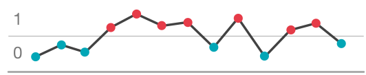

# Auta

A finite state **aut**om**a**ton (aka finite state machine or FSM) library for time series data.  *Auta tells you what you oughta do next.*

## Example

Let's dive in and see how Auta is configured and executed for a simple example problem.

### Data

Suppose that we have streaming time series data where each payload has the form

```python
{
	'time': <monotonically increasing integer>,
	'x': <float >= 0>
}
```

and we are interested in tracking transitions between x <= 1 and x > 1.  We might send an alert when x moves from <= 1 to > 1 or vice versa, or maybe we only care if x > 1 for longer than a certain amount of time.  A precise problem statement is required when designing the state machine.  To be concrete, let's build a system that tracks all periods where x > 1.

### Variables

Before we initiazize Auta, it's important to distinguish between three key variables:

```
value: a normalized, often discrete, encoding of the non-time data in the raw time series

status: the discrete names of the nodes in the state machine (e.g., 'low'/'high')

state: the complete description of the state machine at an instant
```

Data normalization is completely in the hands of the user.  For the problem at hand, the *value* consumed by Auta will be either 0 (x <= 1) or 1 (x > 1). 

The *status* values must also be prescribed by the user.  Let's use 'low' and 'high' for this exersice.  Note that, in general, the *status* does not have a one-to-one relationship to the *value*.  For instance, we could impose a delay on the transition from 'low' to 'high', which means that for some times the *value* is 1 when the *status* is 'low'.

The state in Auta contains the *status*, the timestamp in the time series when the state was emitted, and other data that allows us to update state using only new time series data and the previously recorded *state*.  Below, we'll see what data is in Auta's default state payload.

### Episodes

The *episode* is one of the core concepts in Auta; it is a time interval over which the status takes on one or more noteworthy values.  For the present example, we will use an episode to encode the start and end times of a period with 'high' status.  The episode end time will often be the most recent time stamp.                 


### Initialization

Now that we've covered some of the preliminaries, let's initialize Auta.  Auta initialization requires two ingredients: a configuration and a list of state machine transitions.

The configuration sets the names, types, and values associated with data and state.  For our example problem, the configuration is         

```python
config = {
	'time_key': 'time',
 	'time_type': 'integer',
	'data_values': [0, 1],
	'status_values': ['low', 'high'],
 	'state_initial': {
 		'status': 'low',
 		'episode_start': None,
 		'episode_end': None
 	}
}
 ```

Here we're saying that the time in the raw time series data has key name 'time' and type 'integer', the allowed normalized data values are 0 and 1, and that the allowed status values are 'low' and 'high'.  The last piece of the configuration, under key 'state_initial', specifies the initial state encountered when the state machine is executed for the first time or when state initialization is forced (e.g., when there is a large gap in the time series data).

It is helpful to draw a directed graph showing all possible transitions before encoding the transitions in Auta.


The edges in this graph depict possible transitions from one status to the next as the FSM advances.  If the status in the previous state is 'low' ('L' in the graph), the new status can be 'low' or high, depending on the normalized data value.

Each transition object specifies the initial and final status, a boolean trigger function that indicates the conditions under which the transition is executed, and declarative update rules for the status episode.  Here are the transitions for our example problem:

```python
transitions = [
	{
		'initial': 'low', 'final': 'low',
  		'trigger': lambda d, s: d['value'] == 0,
  		'update': {
  			'episode_end': 'initialize',
  			'episode_start': 'initialize'
  		}
  	},
 	{
 		'initial': 'low', 'final': 'high',
  		'trigger': lambda d, s: d['value'] == 1,
  		'update': {
  			'episode_end': 'advance',
  			'episode_start': 'advance'
  		}
  	},
 	{
 		'initial': 'high', 'final': 'high',
  		'trigger': lambda d, s: d['value'] == 1,
  		'update': {
  			'episode_end': 'advance',
  			'episode_start': 'copy'
  		}
  	},
 	{
 		'initial': 'high', 'final': 'low',
  		'trigger': lambda d, s: d['value'] == 0,
  		'update': {
  			'episode_end': 'initialize',
  			'episode_start': 'initialize'
  		}
  	}
]
```

A trigger function consumes new, normalized time series data and the previous state, and emits True (triggered) or False (not triggered).  Update rules for episodes are given as data, since there are on three possibilities: 

```
initialize: set to the value in the initial state

advance: set to the current data time stamp

copy: set to the value in the previous state  
```  

We're now ready to initialize auta:

```python
>>> import auta
>>> fsm = auta.init(config, transitions, name='twostate')
>>> fsm.name
'twostate'
```

Each initialized Auta FSM has a name (optional), several data attributes, and an *advance* method.  The data attributes expose the configuration, the transition objects, and generated schemas for the time series data and FSM state.  Let's quickly looks at the schemas, since these are new:

```python
>>> fsm.data_schema
{'time': {'required': True, 'type': 'integer'},
 'value': {'allowed': [0, 1], 'required': True}}
>>> fsm.state_schema
{'episode_end': {'nullable': True, 'required': True, 'type': 'integer'},
 'episode_start': {'nullable': True, 'required': True, 'type': 'integer'},
 'episode_status_max': {'allowed': ['low', 'high'], 'nullable': True, 'required': False},
 'status': {'allowed': ['low', 'high'], 'required': True},
 'time': {'nullable': True, 'required': True, 'type': 'integer'}}
```

These are [Cerberus](http://docs.python-cerberus.org/) schemas.  Cerberus is a data validation package that is used to validate the input data and state against the corresponding schema, where each schema is generated based on the supplied configuration.

### Execution

Now that we have an initiazlied FSM, let's see how we supply new data and previous state to advance to the next state:

```python
>>> def normalize(data, time_key):
...     return {
...         time_key: data['time'],
...         'value': 0 if x <= 1 else 1
...     }
>>> state = fsm.config['state_initial']
>>> data = {'time': 0, 'x': 0.4}
>>> data_norm = normalize(data, fsm.config['time_key'])
>>> state = fsm.config['state_initial']
>>> fsm.advance(data_norm, state)
{'episode_end': None,
 'episode_start': None,
 'episode_status_max': None,
 'status': 'low',
 'time': 0}
```

That looks right.  We haven't discuessed `episode_status_max` because it's not used in this example state machine.  `episode_status_max` follows the same update rules as `episode_start` and `episode_end`, and is intended to track the *most severe* status in a given episode when a notion of status severity is applicable.   

Auta provides a `run` function that carries out the above steps for each element in an iterable of normalized time series data.Here's some example data to play with: 

```python
series = [
	{'time': 0, 'x': 0.4},
 	{'time': 1, 'x': 0.7},
 	{'time': 2, 'x': 0.5},
 	{'time': 3, 'x': 1.2},
 	{'time': 4, 'x': 1.6},
 	{'time': 5, 'x': 1.3},
 	{'time': 6, 'x': 1.4},
 	{'time': 7, 'x': 0.7},
 	{'time': 8, 'x': 1.5},
 	{'time': 9, 'x': 0.4},
 	{'time': 10, 'x': 1.1},
 	{'time': 11, 'x': 1.3},
 	{'time': 12, 'x': 0.8}
]
```

This data, along with the expected color-coded status for each point, is illustrated below:




Using the above `normalize` function, we obtain the normalized series:

```python
>>> series_norm = map(lambda d: normalize(d, fsm.config['time_key']), srs)
>>> series_norm
[{'time': 0, 'value': 0},
 {'time': 1, 'value': 0},
 {'time': 2, 'value': 0},
 {'time': 3, 'value': 1},
 {'time': 4, 'value': 1},
 {'time': 5, 'value': 1},
 {'time': 6, 'value': 1},
 {'time': 7, 'value': 0},
 {'time': 8, 'value': 1},
 {'time': 9, 'value': 0},
 {'time': 10, 'value': 1},
 {'time': 11, 'value': 1},
 {'time': 12, 'value': 0}]
```

The result of the `run` function is

```python
>>> list(auta.run(fsm, series_norm, fsm.config['state_initial']))
[{'episode_end': None,
  'episode_start': None,
  'episode_status_max': None,
  'status': 'low',
  'time': 0},
 {'episode_end': None,
  'episode_start': None,
  'episode_status_max': None,
  'status': 'low',
  'time': 1},
 {'episode_end': None,
  'episode_start': None,
  'episode_status_max': None,
  'status': 'low',
  'time': 2},
 {'episode_end': 3,
  'episode_start': 3,
  'episode_status_max': None,
  'status': 'high',
  'time': 3},
 {'episode_end': 4,
  'episode_start': 3,
  'episode_status_max': None,
  'status': 'high',
  'time': 4},
 {'episode_end': 5,
  'episode_start': 3,
  'episode_status_max': None,
  'status': 'high',
  'time': 5},
 {'episode_end': 6,
  'episode_start': 3,
  'episode_status_max': None,
  'status': 'high',
  'time': 6},
 {'episode_end': None,
  'episode_start': None,
  'episode_status_max': None,
  'status': 'low',
  'time': 7},
 {'episode_end': 8,
  'episode_start': 8,
  'episode_status_max': None,
  'status': 'high',
  'time': 8},
 {'episode_end': None,
  'episode_start': None,
  'episode_status_max': None,
  'status': 'low',
  'time': 9},
 {'episode_end': 10,
  'episode_start': 10,
  'episode_status_max': None,
  'status': 'high',
  'time': 10},
 {'episode_end': 11,
  'episode_start': 10,
  'episode_status_max': None,
  'status': 'high',
  'time': 11},
 {'episode_end': None,
  'episode_start': None,
  'episode_status_max': None,
  'status': 'low',
  'time': 12}]
```

Woohoo!  This data matches the above figure!   

### Next Steps

It would be straightforward to build on top of the basic state manager provided by Auta.  State data could be persisted in your favorite DB.  Events could be generated based on state transitions.  From state and event data, one could derive statistics about event frequency or episode duration.

There are more things to discuss regarding Auta's internal mechanics, its limitations, safety precautions, as well as how we might handle more sophisticated state machines.  Stay tuned as  Auta and these docs evolve.     